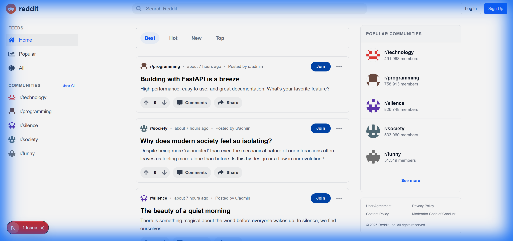
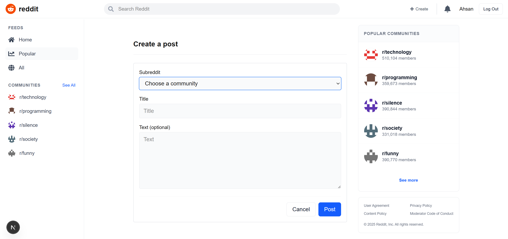
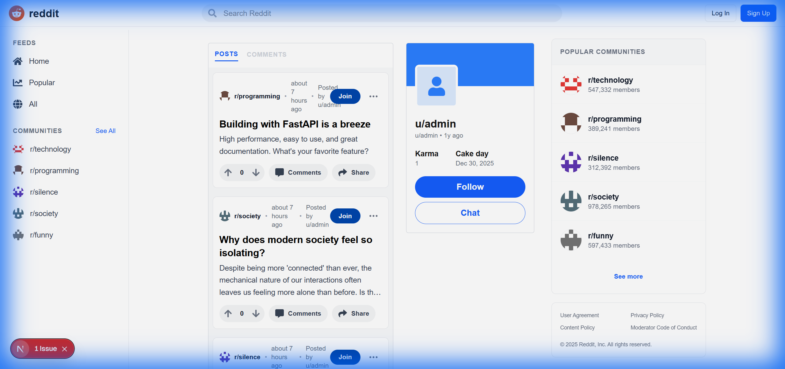

# Full-Stack Reddit Clone

A modern, high-performance Reddit clone built with **FastAPI** (Backend) and **Next.js** (Frontend). This project features real-time notifications, recursive nested comments, voting mechanisms, global search, and community-based discussions.



## 🚀 Features

### Core Reddit Experience
- **Community Management**: Create and browse subreddits (`r/technology`, `r/silent`, etc).
- **Content Creation**: Post text-based content to any community.
- **Recursive Nested Comments**: Infinite-level deep comment threads using PostgreSQL recursive logic.
- **Idempotent Voting**: Standard Reddit-style upvote/downvote system with score calculation.
- **Subreddit Icons**: Automated Identicon generation for all communities.

### Advanced Capabilities
- **Real-time Notifications**: Instant WebSocket alerts when someone comments on your post.
- **Global Search**: Search for posts and communities from the navigation bar.
- **User Profiles**: Track post history and user statistics.
- **Modern Sidebar**: Discover "Popular Communities" with real-time member counts.

## 🛠️ Tech Stack

### Backend
- **Framework**: FastAPI (Python)
- **Database**: PostgreSQL with SQLAlchemy ORM
- **Cache/WS**: Redis
- **Security**: JWT-based OAuth2 authentication

### Frontend
- **Framework**: Next.js 14 (App Router & Turbopack)
- **Styling**: Tailwind CSS
- **State Management**: React Context (Auth)
- **Icons**: React Icons (Fa, Hi)

### Infrastructure
- **Containerization**: Docker & Docker Compose

## 📦 Setup & Installation

### Prerequisites
- Docker & Docker Compose installed on your system.

### Running the Project

1. **Clone the repository**:
   ```bash
   git clone https://github.com/zawster/reddit-thread.git
   cd reddit-thread
   ```

2. **Start the services**:
   ```bash
   docker compose up -d --build
   ```

3. **Seed initial data** (Admin user and default subreddits):
   ```bash
   docker compose exec backend python seed.py
   ```

4. **Access the application**:
   - **Frontend**: [http://localhost:3000](http://localhost:3000)
   - **API Documentation**: [http://localhost:8001/docs](http://localhost:8001/docs)

## 📸 Screenshots

### Home Feed


### Create Post


### User Profile


---
